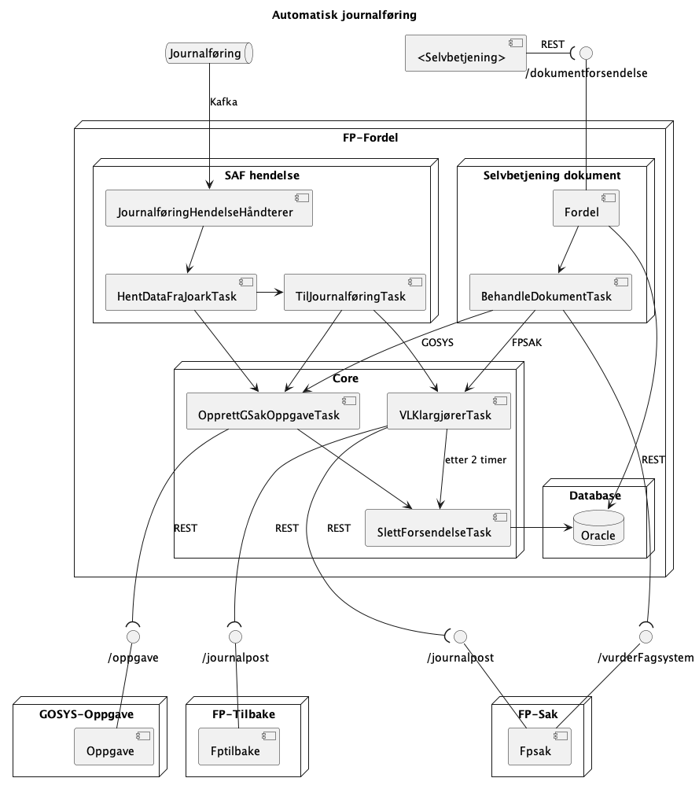

FP-FORDEL
===============
[](https://github.com/navikt/fpfordel/actions/workflows/build.yml)
[](https://sonarcloud.io/summary/new_code?id=navikt_fpfordel)
[](https://sonarcloud.io/summary/new_code?id=navikt_fpfordel)

[](https://sonarcloud.io/dashboard?id=navikt_fpfordel)
[](https://sonarcloud.io/dashboard?id=navikt_fpfordel)
[](https://sonarcloud.io/summary/new_code?id=navikt_fpfordel)
[](https://sonarcloud.io/summary/new_code?id=navikt_fpfordel)
[](https://sonarcloud.io/summary/new_code?id=navikt_fpfordel)
[](https://sonarcloud.io/dashboard?id=navikt_fpfordel)

Dette er kildkode som dekker applikasjonen for fordeling av søknader fra Selvbetjening mellom Gosys, Infotrygd og FPSAK/FPTIBAKE.
Løsningen prøver å journalføre andre dokumenter også - om det ikke er mulig blir de sendt til manuell journalføring.

### Struktur

Dette er løsning for fordeling av søknader (og inntektsmeldinger).

### Kontekst
#### Automatisk dokument behandling
<!-- PlantUml generated from docs/journalføring-diagram.puml. Regenerate Encoded form on https://planttext.com -->

#### Manuell dokument behandling


### Utviklingshåndbok

[Utviklingoppsett](https://confluence.adeo.no/display/LVF/60+Utviklingsoppsett)
[Utviklerhåndbok, Kodestandard, osv](https://confluence.adeo.no/pages/viewpage.action?pageId=190254327)

### Sikkerhet

Det er mulig å kalle tjenesten med bruk av følgende tokens

- Azure CC
- Azure OBO med følgende rettigheter:
    - fpsak-saksbehandler - manuell journalføring
    - fpsak-veileder
    - fpsak-drift
- TokenX
- STS (fases ut)
- SAML (fases ut)

### Docker

```bash
mvn -B -Dfile.encoding=UTF-8 -DskipTests clean install

docker build -t fpfordel .  
```
